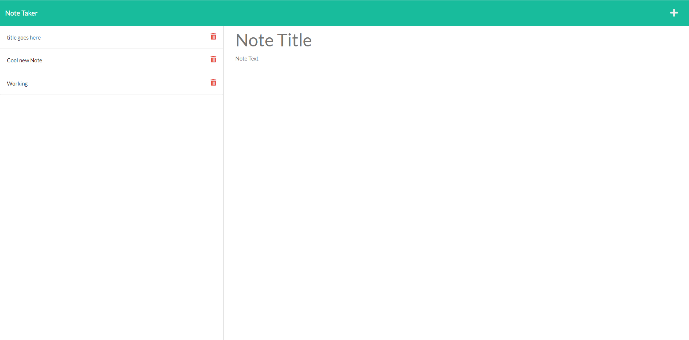

  # Note Taker
  
  
  

## Description 

  * A note taker app.  This application allows you to write notes that are saved on the left of the screen for easy retrieval.

## Link to Active Product

  * http://craigmjensen.github.io/note-taker/
  * https://intense-meadow-12785.herokuapp.com/

## Table of Contents

  * [Usage](#usage)
  * [License](#license)

## Screenshot

  

## Usage

  * Visit the live page at https://intense-meadow-12785.herokuapp.com/

  
## License

  

  * This project is covered under [MIT](https://choosealicense.com/licenses/mit/)

## Questions?

  * Contact me at: CMJensen82@gmail.com
  * Github: https://github.com/craigmjensen/

